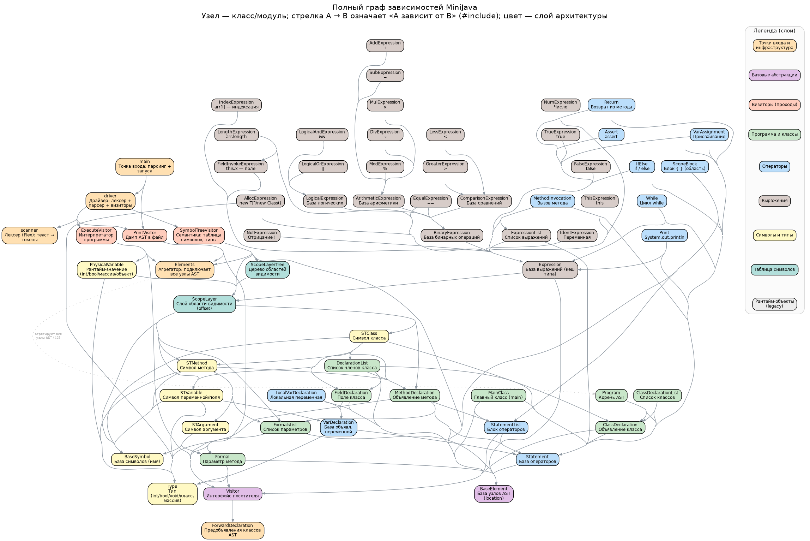

# Compiler

Компилятор подмножества языка Java. Проект предназначен для сборки исходного кода и запуска тестов через скрипт автоматической проверки.

## Что описывает грамматика

- `program` - главный класс + список остальных классов;
- `main_class` — класс с методом public static void main();
- `class_declaration` — класс (extends временно не работает), содержит поля и методы;
-	`method_declaration` — метод с типом возврата, параметрами и телом;
-	операторы (`statement`): объявление переменной, присваивание, if/else, while, print, assert, return, вызов метода, блок { … };
- выражения (`expr`): арифметика, сравнения, логика, индексация массива, .length, new, this, литералы, вызовы методов и обращения к полям.

## Требования

Для сборки и запуска проекта нужны:
- `cmake`
- `make`
- `flex`
- `bison`

## Структура проекта



## Сборка

Сборка выполняется из корня проекта следующими командами:

```bash
mkdir build && cd build && cmake .. && make -j && cd ..
```

После успешной сборки исполняемый файл будет находиться в `build/Compiler`, а запуск производится с указанием входного и выходного файлов:

```bash
./build/Compiler input out
```

## Запуск тестов

Для запуска всех тестов используйте скрипт:

```bash
./run_all_tests.sh
```

Скрипт последовательно запускает весь набор тестов проекта и выводит результаты проверки в консоль.

## Структура запуска

Типичный рабочий цикл выглядит так:
1. Собрать проект.
2. Запустить компилятор на нужном входном файле.
3. Проверить корректность работы через `run_all_tests.sh`.

## Пример

```bash
mkdir build && cd build && cmake .. && make -j && cd ..
./build/Compiler mini-java out
./run_all_tests.sh
```
